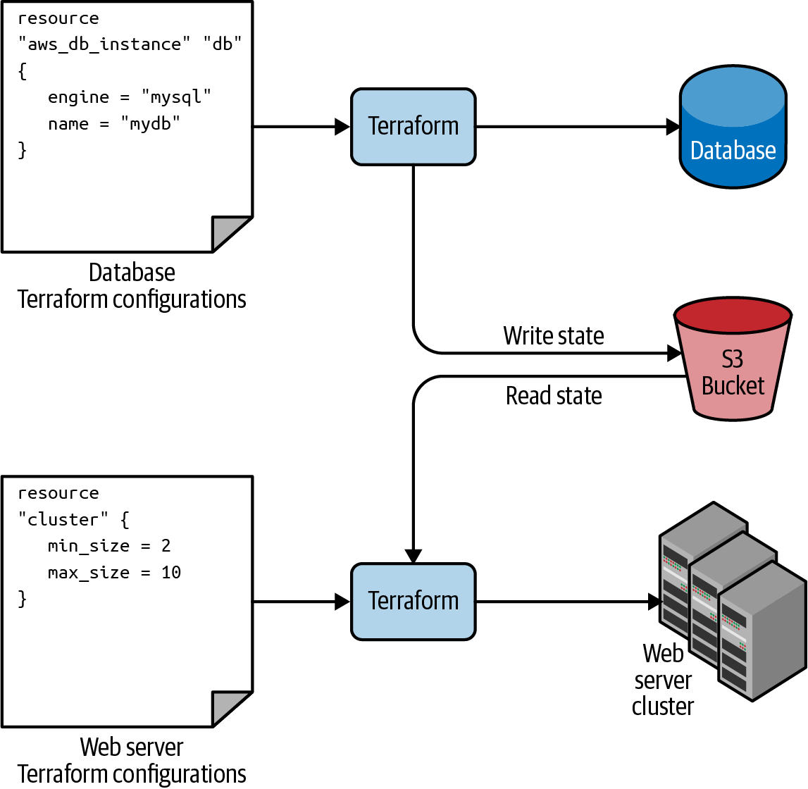

이 장에서 다룰 내용

- 테라폼 상태
- 상태 파일 공유
- 상태파일 격리 : 1) 워크스페이스 2) 파일 레이아웃
- terraform_remote_state 리소스

# 테라폼 상태

: 테라폼이 생성한 인프라에 대한 정보 기록

이와 같은 테라폼 구성파일을 `apply` 명령어로 실행하면

```bash
resource "aws_instance" "example" {
  ami           = "ami-0fb653ca2d3203ac1"
  instance_type = "t2.micro"
}
```

아래와 같은 생성한 리소스 정보가 terraform.tfstate 파일에 기록되어 테라폼 명령어 수행시 이전에 생성했던 리소스 정보를 추적한다.

```bash
{
  "version": 4,
  "terraform_version": "1.2.3",
  "serial": 1,
  "lineage": "86545604-7463-4aa5-e9e8-a2a221de98d2",
  "outputs": {},
  "resources": [
    {
      "mode": "managed",
      "type": "aws_instance",
      "name": "example",
      "provider": "provider[\"registry.terraform.io/hashicorp/aws\"]",
      "instances": [
        {
          "schema_version": 1,
          "attributes": {
            "ami": "ami-0fb653ca2d3203ac1",
            "availability_zone": "us-east-2b",
            "id": "i-0bc4bbe5b84387543",
            "instance_state": "running",
            "instance_type": "t2.micro",
            "(...)": "(truncated)"
          }
        }
      ]
    }
  ]
}
```

테라폼을 팀 단위로 사용하려면 tfstate 상태 파일을 공유해야 하는데 몇 가지 해결해야 하는 문제가 있다.

- 상태 파일 공유 저장소
    - 모든 사용자는 동일한 상태파일에 액세스 해야 한다
- 상태 파일 잠금
    - 경합 상태를 피하기 위해 잠금을 획득해야 한다
- 상태 파일 격리
    - 다른 환경에 대한 테라폼 구성 실행에 영향 받지 않게 환경 별로 상태파일이 격리 되어야 한다

# 상태 파일 공유

테라폼 백엔드 기능을 사용하여 tfstate 를 원격 저장소에 세이브 & 로드 할 수 있다. 

<aside>
💡 사용 가능한 테라폼 백엔드 : local, s3, azure blob, gcs, pg, http, k8s, oss, cos, consul, remote

</aside>

## 테라폼 백엔드 장점

- `apply` 명령어 수행시 원격 저장소에서 상태 파일을 자동으로 로드 하고 구성 후 자동으로 저장하므로 실수를 방지 할 수 있다
- 파일 잠금 기능 지원
- 대부분의 백엔드는 파일에 대한 접근 제한을 구성할 수 있고 전송하거나 상태파일 저장시 파일을 암호할 수 있다

## AWS S3 테라폼 백엔드 예

- 공급자 설정
- 상태 파일이 저장될 s3 버킷 생성
- 롤백을 위해 versioning enable
- 서버 측 암호화 설정. 상태 파일 및 파일에 포함 된 시크릿 암호화

```bash
provider "aws" {
  region = "us-east-2"
}

resource "aws_s3_bucket" "terraform_state" {
  bucket = "terraform-up-and-running-state"

  # Prevent accidental deletion of this S3 bucket
  lifecycle {
    prevent_destroy = true
  }
}

# Enable versioning so you can see the full revision history of your
# state files
resource "aws_s3_bucket_versioning" "enabled" {
  bucket = aws_s3_bucket.terraform_state.id
  versioning_configuration {
    status = "Enabled"
  }
}

# Enable server-side encryption by default
resource "aws_s3_bucket_server_side_encryption_configuration" "default" {
  bucket = aws_s3_bucket.terraform_state.id

  rule {
    apply_server_side_encryption_by_default {
      sse_algorithm = "AES256"
    }
  }
}
```

- 잠금에 사용할 키-밸류 저장소 구성
    - 백엔드에서 지원하는 잠금 획득 방식이 있으며 모든 백엔드가 잠금을 지원하는 것은 아니다
    - s3 백엔드의 경우 dynamo db를 사용하여 상태 잠금을 지원한다.
    - `LockID` 를 기본키로 지정
    - 강제 잠금 해제 `force-unlock` 가능

```bash
resource "aws_dynamodb_table" "terraform_locks" {
  name         = "terraform-up-and-running-locks"
  billing_mode = "PAY_PER_REQUEST"
  hash_key     = "LockID"

  attribute {
    name = "LockID"
    type = "S"
  }
}

output "s3_bucket_arn" {
  value       = aws_s3_bucket.terraform_state.arn
  description = "The ARN of the S3 bucket"
}

output "dynamodb_table_name" {
  value       = aws_dynamodb_table.terraform_locks.name
  description = "The name of the DynamoDB table"
}
```

- 테라폼 블록에 백엔드 구성 구문 추가

```bash
terraform {
  backend "s3" {
    # Replace this with your bucket name!
    bucket         = "terraform-up-and-running-state"
    key            = "global/s3/terraform.tfstate"
    region         = "us-east-2"

    # Replace this with your DynamoDB table name!
    dynamodb_table = "terraform-up-and-running-locks"
    encrypt        = true
  }
}
```

결과

```bash
$ terraform apply

(...)

Acquiring state lock. This may take a few moments...

aws_dynamodb_table.terraform_locks: Refreshing state...
aws_s3_bucket.terraform_state: Refreshing state...

Apply complete! Resources: 0 added, 0 changed, 0 destroyed.

Releasing state lock. This may take a few moments...

Outputs:

dynamodb_table_name = "terraform-up-and-running-locks"
s3_bucket_arn = "arn:aws:s3:::terraform-up-and-running-state"
```


## Dynamodb table

```markdown
|LockID|Info|
|------|---|
|qqllio-terraform-up-and-running-state/global/s3/terraform.tfstate|{"ID":"59fef1d5-d094-c52e-6aa5-e30279394a88","Operation":"OperationTypeApply","Info":"","Who":"aa@aaui-MacBook-Pro.local","Version":"1.1.7","Created":"2022-12-11T09:55:24.570354Z","Path":"qqllio-terraform-up-and-running-state/global/s3/terraform.tfstate"}|
```

```bash
$ terraform destroy
```

```markdown
|LockID|Digest|
|------|---|
|qqllio-terraform-up-and-running-state/global/s3/terraform.tfstate-md5|5fced019676836afd36359eb97cd7bd8|
```


## 테라폼 백엔드 단점

- 테라폼 코드를 실행하기 전 s3 버킷과 다이나모 테이블을 미리 만들어 둬야 함. 삭제할때도 코드 destroy 후 버킷 삭제 필요 → 통합되지 않고 프로세스로 관리해야 함
- 테라폼 백엔드 블록에서 참조 변수 사용할 수 없음.
    - bucket, region, table 등 공통 부분을 별도의 hcl 파일로 추출해 terraform init 시 인수와 함께 실행 할 수 있다.
    - 혹은 또다른 오픈 소스 도구인 테라그런트를 사용하여 코드 반복을 없앨 수 있다

# 상태 파일 격리

환경 간에 상태 파일을 격리하여 다른 환경에서의 구성이 또 다른 환경에 영향이 가지 않도록 해야 한다.


상태 파일을 격리하는 2 가지 방법

- 워크 스페이스
- 파일 레이아웃

## 워크 스페이스를 통한 격리

테라폼 워크스페이스를 통해 테라폼 상태를 별도의 이름을 가진 여러 개의 작업 공간에 저장할 수 있다. 지정하지 않았을 때 ‘default’ 라는 기본 작업 공간이 주어지며 `terraform workspace` 명령을 통해 새 워크 스페이스를 만들고 지울 수 있다.

```bash
terraform {
  backend "s3" {
    # Replace this with your bucket name!
    bucket         = "terraform-up-and-running-state"
    key            = "workspaces-example/terraform.tfstate"
    region         = "us-east-2"

    # Replace this with your DynamoDB table name!
    dynamodb_table = "terraform-up-and-running-locks"
    encrypt        = true
  }
}
```

```bash
$ terraform workspace new example1
Created and switched to workspace "example1"!

You're now on a new, empty workspace. Workspaces isolate their state,
so if you run "terraform plan" Terraform will not see any existing state
for this configuration.
```

위와 같이 별도의 워크스페이스를 만들고 테라폼을 apply 하면 s3 버킷 :env 하위에 워크스페이스 별로 각각의 tfstate 를 저장한다

예) `terraform-up-and-running-state/env:/example1/workspaces-example/terraform.tfstate` 

워크스페이스 분리 격리는 쉽고 빠르게 적용할 수 있지만 

- 테라폼 코드가 모든 환경에서 동일 하므로 환경마다 다른 구성을 하기 위해 삼항 연산자나 조건 논리를 통해 코드 안에서 분기 처리해야 하고
- 작업 공간에 대한 정보가 코드 안에 포함되어 있지 않으므로 유지 관리가 어렵다 →휴먼 에러 유발 가능성

## 파일 레이아웃을 이용한 격리

- 환경 뿐만 아니라 컴포넌트 단위로 파일을 격리 한다
- 공통 구성은 하나로 합쳐 코드 중복 회피
- 환경 별로 서로 다른 백엔드를 구성한다. 즉 분리된 s3 버킷을 사용하고 별도의 인증정보를 구성할 수도 있다
- 다만 컴포넌트 단위로 파일을 격리하면 컴포넌트마다 `apply` 를 해줘야 하므로 한번에 전체 인프라를 구성할 수 없음 → 실수 유발 가능성
- 테라그런트를 사용하면 apply-all 명령을 사용하여 프로세스를 자동화할 수 있음


### 테라그런트란?

> DRY and maintainable Terraform code. Terragrunt is a thin wrapper that provides extra tools for keeping your configurations DRY, working with multiple Terraform modules, and managing remote state.
> 
- 환경 변수를 관리할 수 있음
- 코드를 반복 작성하지 않을 수 있게 조각 코드를 만들어 참조하고 최종 코드를 생성해줌

```bash
├── README.md
│   ├── modules
│   │   ├── dev
│   │   │   ├── global
│   │   │   │   ├── iam
│   │   │   │   │   ├── backend.tf
│   │   │   │   │   ├── provider.tf
│   │   │   │   │   ├── main.tf
│   │   │   │   │   └── terragrunt.hcl
│   │   │   │   └── s3
│   │   │   │       ├── backend.tf
│   │   │   │       ├── provider.tf
│   │   │   │       ├── main.tf
│   │   │   │       └── terragrunt.hcl 
│   │   │   ├── terragrunt.hcl  
```

- 여러 모듈에 대해 한번의 커맨드로 실행
    - terragrunt apply-all
    - terragrunt destroy-all

# terraform_remote_state 데이터소스

데이터 소스를 사용하면 다른 테라폼 구성 세트에 완전한 읽기 전용 방식으로 저장된 테라폼 상태 파일을 가져올 수 있다. 



가령 db의 어드레스, 포트는 실행시 마다 달라질 수 있는데 출력 값을 테라폼 상태 파일에 저장하고 서비스에서 terraform_remote_state 데이터 소스를 추가하여 상태 파일에서 읽어갈 수 있다.

db main.tf

```bash
output "address" {
  value       = aws_db_instance.example.address
  description = "Connect to the database at this endpoint"
}

output "port" {
  value       = aws_db_instance.example.port
  description = "The port the database is listening on"
}
```

service main.tf

```bash
data "terraform_remote_state" "db" {
  backend = "s3"

  config = {
    bucket = "(YOUR_BUCKET_NAME)"
    key    = "stage/data-stores/mysql/terraform.tfstate"
    region = "us-east-2"
  }
}
```